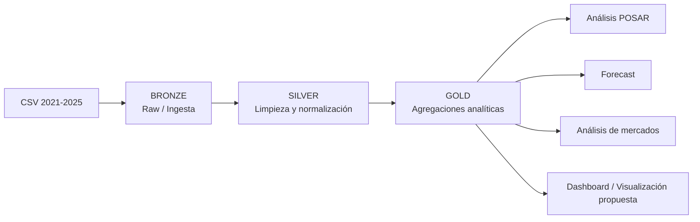

# Proyeccion_exportacion_gulupa

# Proyecto Final: Big Data y Análisis de Exportaciones de Gulupa

## 1. Caso de negocio

### 1.1 Descripción del problema

El proyecto analiza información de exportaciones de gulupa correspondiente al período **2021-2025**, implementando una arquitectura de datos **Medallion (Bronze, Silver y Gold)** en Databricks.

El problema de negocio se aborda desde tres necesidades principales:

- Consolidar información histórica de exportaciones proveniente de archivos CSV con diferencias de formato entre períodos.
- Estandarizar y depurar los datos para obtener información confiable para análisis.
- Generar información analítica que permita estudiar el comportamiento de las exportaciones, proyectar valores futuros y analizar mercados internacionales.

Un problema específico identificado en los datos es la representación diferente del código arancelario de la gulupa: `0810901030` y `810901030`, debido al cero inicial.

### 1.2 Objetivo general

Construir un pipeline de Big Data en Databricks que permita ingerir, limpiar, transformar y analizar los datos históricos de exportaciones de gulupa, generando tablas analíticas para apoyar el análisis de mercados y la proyección de exportaciones.

### 1.3 Objetivos específicos

1. Ingerir los archivos históricos de exportaciones de 2021 a 2025.
2. Estandarizar formatos y tipos de datos.
3. Implementar las capas Bronze, Silver y Gold.
4. Analizar la inconsistencia del código POSAR de gulupa con y sin cero inicial.
5. Construir agregaciones por departamento, país y período mensual.
6. Generar un modelo de pronóstico de exportaciones.
7. Calcular crecimiento histórico por mercado mediante CAGR.
8. Preparar tablas Gold para una futura visualización o dashboard.

### 1.4 Indicadores obtenidos

| Indicador | Resultado |
|---|---:|
| Período histórico | 2021-2025 |
| Registros ingeridos en Bronze | 2.428.910 |
| Registros después de limpieza en Silver | 2.340.149 |
| Registros filtrados/no conservados entre Bronze y Silver | 88.761 |
| Columnas originales/esquema Bronze | 31 |
| Departamentos en Gold | 34 |
| Períodos mensuales en Gold | 58 |
| Países destino en Gold | 215 |
| Registros específicos de gulupa (`810901030`) | 6.571 |

> Los valores anteriores corresponden a las salidas ejecutadas en el notebook de Databricks.

---

# 2. Relación beneficio / costo

## 2.1 Beneficios esperados

La solución genera beneficios principalmente en términos de calidad, automatización y capacidad analítica:

- **Centralización:** los archivos históricos se consolidan en una estructura común.
- **Calidad de datos:** se corrigen formatos numéricos, fechas y códigos.
- **Trazabilidad:** se conserva información de origen y fecha de ingesta.
- **Escalabilidad:** Spark permite procesar millones de registros.
- **Reutilización:** las tablas Gold pueden alimentar visualizaciones y análisis posteriores.
- **Análisis predictivo:** se incorpora un modelo para proyectar el valor FOB.
- **Análisis de mercados:** se calcula crecimiento por país para detectar mercados con variaciones importantes.

## 2.2 Costos considerados

El notebook suministrado **no contiene información monetaria sobre costos de infraestructura, licenciamiento, horas de desarrollo, almacenamiento o consumo de Databricks**. Por esta razón, no es correcto inventar un ROI numérico.

Para completar esta sección en la presentación final, se recomienda registrar:

| Componente | Dato requerido |
|---|---|
| Infraestructura/Databricks | Costo mensual |
| Almacenamiento | Costo mensual |
| Desarrollo | Horas × costo/hora |
| Mantenimiento | Horas mensuales × costo/hora |
| Visualización | Licencia/costo mensual |
| Beneficio económico estimado | Ahorro o incremento de ingresos |

### Fórmula propuesta

**Beneficio neto = Beneficios económicos − Costos del proyecto**

**ROI = (Beneficio neto / Costo total) × 100**

### Conclusión de esta sección

Con la información disponible en el notebook se puede demostrar el **beneficio técnico y analítico**, pero no calcular un retorno financiero real. Para presentar un ROI monetario se requiere incorporar los costos y beneficios económicos del negocio.

---

# 3. Arquitectura propuesta

## 3.1 Arquitectura Medallion

La solución implementa tres capas:



### Bronze

Ruta utilizada:

`/Volumes/bigdata/bronze/gulupa_raw`

Tabla:

`bigdata.bronze.gulupa_exportaciones_raw`

Características:

- Ingesta de archivos CSV.
- 2021-2022 utilizan delimitador coma.
- 2023-2025 utilizan delimitador punto y coma.
- Se utiliza un esquema explícito.
- Las variables se cargan inicialmente como `string`.
- Se agregan `_archivo_origen` y `_fecha_ingesta`.

Resultado: **2.428.910 registros y 31 columnas**.

### Silver

Tabla:

`bigdata.silver.gulupa_exportaciones_clean`

Procesos principales:

- Conversión de `FECH` desde formato `YYMM`.
- Conversión de valores numéricos.
- Manejo de separadores decimales europeos.
- Conversión de códigos y campos numéricos.
- Normalización de POSAR.
- Creación de `anio` y `mes`.
- Filtrado de años 2021-2025.
- Filtrado de meses válidos.
- Eliminación de valores FOB nulos o menores/iguales a cero.
- Eliminación de duplicados mediante una llave compuesta.

Resultado: **2.340.149 registros**.

### Gold

Se generan tablas analíticas Delta:

| Tabla | Propósito |
|---|---|
| `gulupa_top_departamentos` | FOB, peso y número de exportaciones por departamento |
| `gulupa_exportaciones_mensuales` | FOB, peso, cantidad y registros por mes |
| `gulupa_top_paises` | FOB, peso y número de exportaciones por país |
| `gulupa_posar_analisis` | Comparación POSAR con y sin cero inicial |
| `gulupa_forecast_2026` | Pronóstico mensual de FOB para 2026 según la salida ejecutada |
| `gulupa_potencial_mercados` | Crecimiento CAGR por mercado |

## 3.2 Tecnologías

- Databricks
- Apache Spark / PySpark
- Delta Lake
- Python
- Pandas
- NumPy
- Scikit-learn
- SQL

---

# 4. Pipeline de ingesta de datos

Esta es la parte central de la solución.

## 4.1 Flujo general

```text
Archivos CSV
     │
     ├── 2021-2022: delimitador ,
     │
     └── 2023-2025: delimitador ;
              │
              ▼
        BRONZE / RAW
              │
              ▼
      Validación y filtros
              │
              ▼
       SILVER / CLEAN
              │
       ┌──────┼───────────┐
       ▼      ▼           ▼
  Mensual  Países    Departamentos
       │      │           │
       └──────┼───────────┘
              ▼
          GOLD / BI
              │
       ┌──────┼───────────────┐
       ▼      ▼               ▼
   Forecast  POSAR       Mercados CAGR
```

## 4.2 Estrategia de ingesta

El pipeline identifica que existen dos estructuras de archivo:

- **2021-2022:** archivos separados por coma y con 29 campos de negocio.
- **2023-2025:** archivos separados por punto y coma y con ausencia de `NIT` y `RAZ_SIAL`.

Para evitar conflictos de tipos, se utiliza un esquema explícito con campos inicialmente como `StringType`.

Posteriormente se realiza:

1. Lectura de archivos.
2. Unión de los DataFrames.
3. Adición de metadatos.
4. Validación de estructura.
5. Persistencia en Delta.
6. Transformación hacia Silver.
7. Generación de tablas Gold.

## 4.3 Control de calidad

El pipeline aplica controles sobre:

### Fecha

`FECH` llega como texto con formato `YYMM`.

Ejemplo:

`2101 → enero de 2021`

Se transforma en:

- `anio`
- `mes`

### Valores numéricos

Se convierten campos como:

- `FOBDOL` → `valor_fob_usd`
- `FOBPES` → `valor_fob_cop`
- `PNK` → `peso_neto_kg`
- `PBK` → `peso_bruto_kg`
- `CANTI` → `cantidad`

También se contempla el valor `-` como dato nulo.

### Formato decimal

Para los archivos que utilizan formato europeo se realiza la transformación necesaria para convertir valores como:

`1.234,56 → 1234.56`

### Código POSAR

Se conservan:

- `posar_original`
- `posar_tiene_cero`
- `posar_normalizado`
- `codigo_producto`

Esto permite estudiar el impacto del cero inicial sin perder el valor original.

### Duplicados

La capa Silver aplica `dropDuplicates` utilizando:

- año
- mes
- departamento
- país
- código de producto
- NIT
- cantidad
- valor FOB

## 4.4 Resultado del pipeline

| Capa | Tabla | Registros |
|---|---|---:|
| Bronze | `gulupa_exportaciones_raw` | 2.428.910 |
| Silver | `gulupa_exportaciones_clean` | 2.340.149 |
| Gold | `gulupa_top_departamentos` | 34 |
| Gold | `gulupa_exportaciones_mensuales` | 58 |
| Gold | `gulupa_top_paises` | 215 |

Entre Bronze y Silver se conservan aproximadamente **96,35 %** de los registros.

## 4.5 Análisis de calidad del código de producto

Para el código normalizado `810901030` se identificaron **6.571 registros**:

| Representación | Registros | FOB USD |
|---|---:|---:|
| Sin cero inicial | 4.721 | 154.661.632,01 |
| Con cero inicial | 1.850 | 93.068.359,12 |
| Total | 6.571 | 247.729.991,13 |

El análisis demuestra por qué es importante normalizar el código, pero al mismo tiempo conservar su representación original para trazabilidad.

## 4.6 Eficiencia del procesamiento

La arquitectura permite separar:

- datos crudos,
- datos transformados,
- datos listos para análisis.

Esto evita repetir toda la transformación cada vez que se necesita un indicador y facilita que los consumidores trabajen directamente con las tablas Gold.

> El notebook no contiene mediciones de tiempo de ejecución, consumo de DBU, CPU, memoria o costo energético. Por lo tanto, no se presenta un porcentaje cuantitativo de eficiencia energética que no esté respaldado por datos.

---

# 5. Modelos de ciencia de datos

## 5.1 Modelo de pronóstico de exportaciones

Se construye un modelo de **regresión lineal con estacionalidad mensual**.

### Variables utilizadas

**Variable objetivo:**

`fob_usd`

**Variables explicativas:**

- tendencia temporal (`trend`)
- variables dummy para los meses del año

El modelo se entrena utilizando **58 meses disponibles** en la tabla mensual.

### Resultado del modelo

El notebook reporta:

**R² = 0,2600**

Esto significa que el modelo presenta un ajuste histórico limitado; por ello, las proyecciones deben interpretarse como una estimación y no como un valor garantizado.

### Pronóstico 2026

La salida ejecutada del notebook reporta:

**FOB 2025:** USD 49.929.163.805,61

**FOB proyectado 2026:** USD 52.235.022.552,06

**Crecimiento proyectado:** 4,6 %

El valor mensual más alto proyectado en 2026 corresponde a julio:

**USD 4.760.332.848,23**

## 5.2 Intervalo de incertidumbre

El notebook calcula límites inferior y superior utilizando los residuales del modelo y un factor de 1,96.

Por ejemplo, para enero de 2026:

- Predicción: USD 3.772.131.861
- Límite inferior: USD 2.794.900.716
- Límite superior: USD 4.749.363.006

## 5.3 Análisis de crecimiento de mercados

Se calcula el **CAGR 2021-2025**:

**CAGR = (FOB 2025 / FOB 2021)^(1/4) − 1**

El análisis permite identificar países que presentan fuertes variaciones porcentuales entre 2021 y 2025.

Entre los códigos de país que aparecen en la salida del notebook se encuentran:

- NCL
- MDA
- NAM
- LUX
- KGZ
- MNE
- CMR
- AIA
- BGR
- ZWE

### Advertencia metodológica

Los porcentajes de CAGR pueden resultar muy elevados cuando el valor inicial de 2021 es pequeño. Por ello, el CAGR debe analizarse junto con el valor FOB absoluto y el número de operaciones, no de manera aislada.

---

# 6. Aplicación / visualización

## 6.1 Estado actual

El notebook deja preparadas varias tablas Gold específicamente para consumo analítico y menciona su utilización para un dashboard.

Sin embargo, **en el notebook suministrado no se evidencia la implementación de una aplicación final, un Serving Endpoint o un dashboard publicado**.

Por lo tanto, esta sección debe presentarse como una propuesta de visualización si el entregable final exige una aplicación.

## 6.2 Dashboard propuesto

Se recomienda construir un dashboard con los siguientes componentes:

### Indicadores principales

- FOB total USD
- Peso neto exportado
- Cantidad exportada
- Número de operaciones
- Variación anual

### Visualizaciones

**1. Evolución mensual**

Gráfico de líneas con:

- eje X: mes
- eje Y: FOB USD

**2. Distribución por país**

Mapa o barras con:

- país destino
- FOB USD

**3. Departamentos**

Ranking de departamentos por:

- FOB USD
- peso neto
- número de exportaciones

**4. Forecast**

Gráfico con:

- histórico
- pronóstico 2026
- límite inferior
- límite superior

**5. Mercados**

Tabla/gráfico con:

- país
- FOB 2021
- FOB 2025
- CAGR

**6. Calidad POSAR**

Comparación:

- con cero inicial
- sin cero inicial

## 6.3 Arquitectura de visualización propuesta

```text
Databricks
    │
    ▼
Tablas GOLD
    │
    ├── KPIs
    ├── Series mensuales
    ├── Países
    ├── Departamentos
    ├── Forecast
    └── Mercados
            │
            ▼
      Dashboard BI
            │
            ▼
      Usuario de negocio
```

---

# 7. Conclusiones

1. Se implementó una arquitectura Medallion para procesar información de exportaciones de 2021-2025.
2. La capa Bronze recibió **2.428.910 registros**, mientras que Silver conservó **2.340.149 registros** después de las transformaciones y controles.
3. La solución resuelve diferencias de delimitadores, formatos numéricos, fechas y representación del código POSAR.
4. Las tablas Gold permiten realizar análisis por período, departamento y país.
5. El análisis POSAR identificó **6.571 registros** correspondientes al código normalizado `810901030`.
6. Se implementó un modelo de regresión lineal con estacionalidad mensual para pronosticar el FOB de 2026.
7. El modelo obtuvo un **R² de 0,2600**, por lo que sus resultados deben interpretarse considerando su capacidad explicativa limitada.
8. El notebook reporta un FOB proyectado para 2026 de **USD 52.235 millones**, frente a **USD 49.929 millones en 2025**, equivalente a un crecimiento proyectado de 4,6 %.
9. El cálculo de CAGR permite explorar cambios en los mercados internacionales, pero debe complementarse con valores absolutos debido al efecto de bases iniciales pequeñas.
10. Para completar integralmente el proyecto académico, faltan en el notebook suministrado: **costos monetarios para calcular ROI, una medición cuantitativa de eficiencia energética y la implementación demostrable de un dashboard/app o Serving Endpoint**.

---

# 8. Estructura recomendada del repositorio GitHub

```text
gulupa-big-data/
│
├── README.md
├── notebooks/
│   └── Medallion Gulupa Exportaciones.ipynb
│
├── docs/
│   ├── arquitectura.md
│   ├── modelo-ciencia-datos.md
│   └── resultados.md
│
├── dashboard/
│   └── README.md
│
└── data/
    └── README.md
```

## Checklist frente a la rúbrica

| Requisito | Evidencia en el proyecto | Estado |
|---|---|---|
| 1. Caso de negocio | Problema, objetivos e indicadores | ✅ |
| 2. Beneficio/costo | Beneficios identificados; faltan costos reales para ROI | ⚠️ |
| 3. Arquitectura | Medallion Bronze/Silver/Gold en Delta | ✅ |
| 4. Pipeline de ingesta | Ingesta, limpieza, normalización, calidad y tablas Gold | ✅ |
| 5. Modelos de ciencia de datos | Regresión lineal + estacionalidad y CAGR | ✅ |
| 6. App/visualización | Tablas preparadas para dashboard; dashboard no evidenciado en notebook | ⚠️ |

